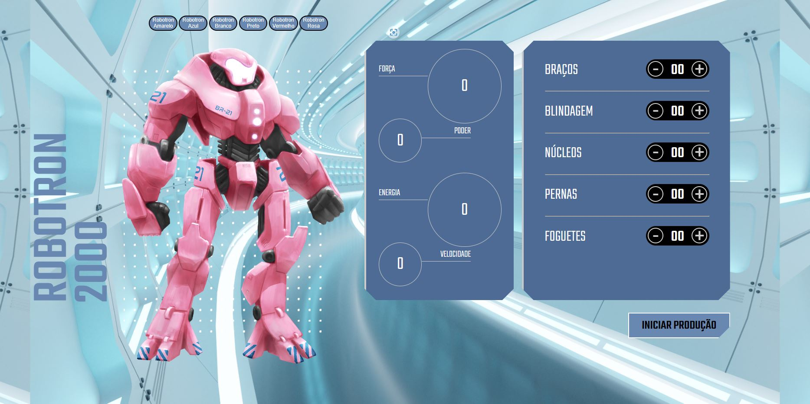

<h1 align='center'>ROBOTRON 2000 🤖</h1>

 Projeto desenvolvido no curso de Javascript: Manipulando o DOM da plataforma Alura

  

## 💻Projeto
Neste treinamento foi abordado fundamentos de manipulação de elementos no DOM utilizando JavaScript e como hospedar o projeto na nuvem.

📍  [Acesse aqui](https://robotron-2000-sooty.vercel.app/)

